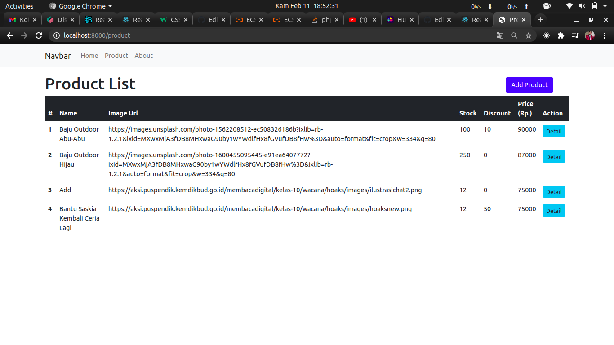
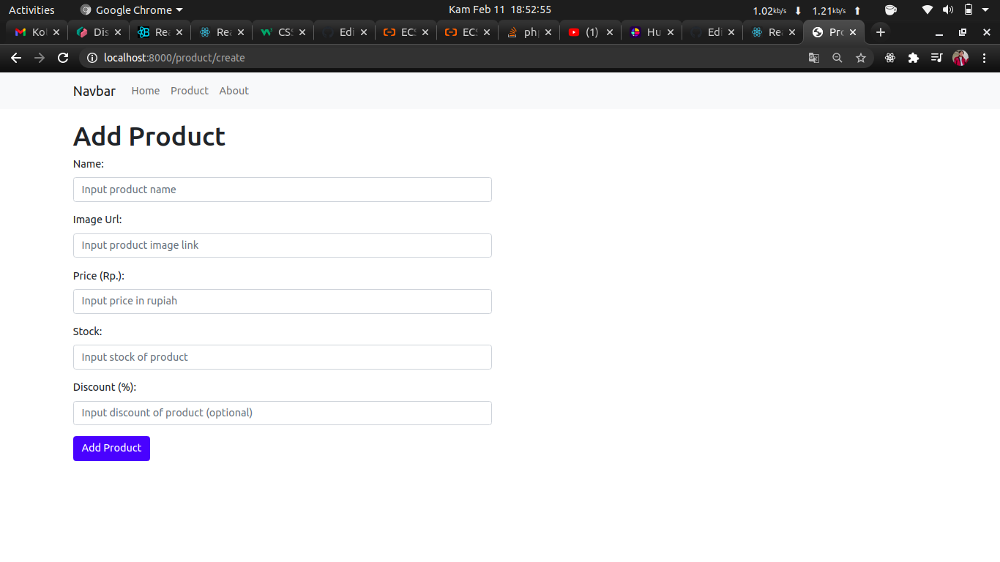
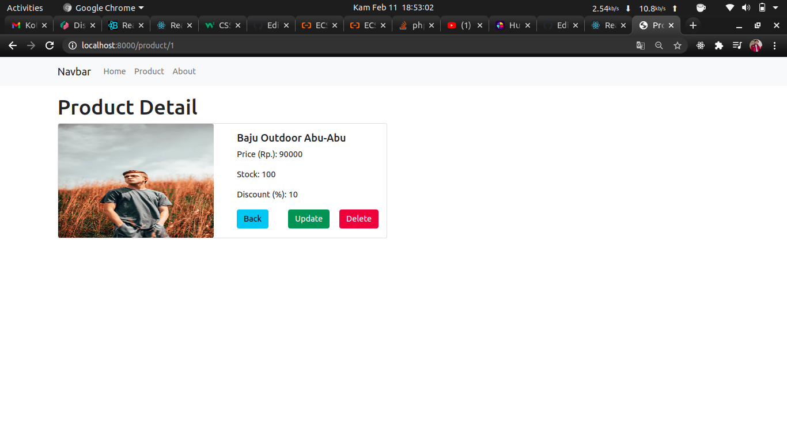
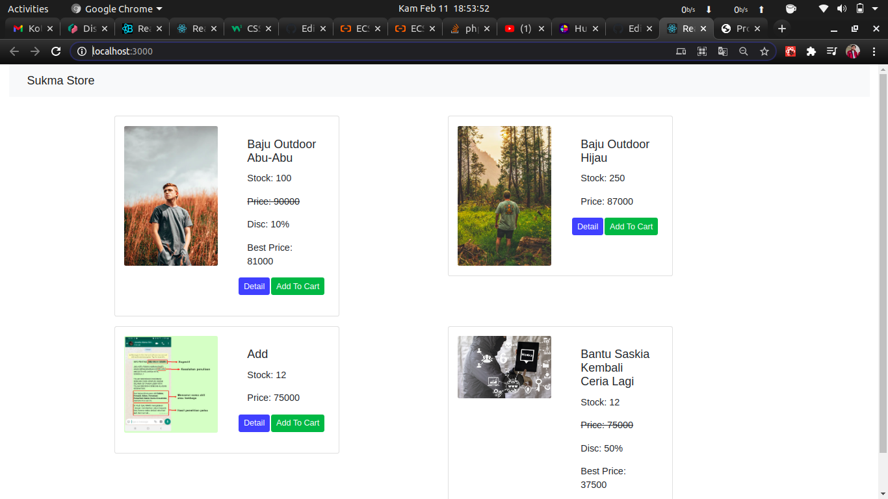

# Surya-Makmur

## Display Dashboard (CRUD Laravel)

    * Product List
    

    * Add Product
    

    * Detail Produt
    

    * Update Product
    

## Display Client ReactJS (Disc Handle)

    * Product List Client
    
